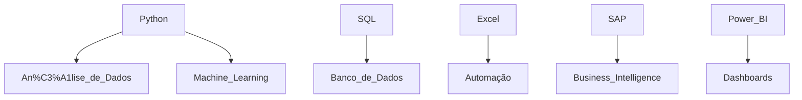

<h1 align="center">
    
</h1>

  

---

<h2 align="center">
    Explorando Dados e o Universo da Tecnologia! 🌍
</h2>

    
    
    
    

---

##  Sobre Mim
✨ Exploradora do universo dos dados, em constante aprendizado e desenvolvimento! 😆  
📊 Atualmente estudando **Power BI, SQL, Python, Excel e SAP** e aprimorando habilidades em análise de dados.  
🌠 Meu objetivo é **transformar dados em insights estratégicos e crescer profissionalmente na área de tecnologia!**  

---

##  **Minhas Tecnologias**

  

---

##  **Minha Jornada de Aprendizado**

📌 Testando códigos, quebrando tudo e aprendendo no processo! 🚀

---

##  **Estatísticas do Meu GitHub**

   
  

---

##  **Conquistas**

 
   

---

##  **Onde Me Encontrar?**

 
   
   

<h4 align="center">📊 Dados são como café: se bem filtrados, te mantêm acordado. Se não, só te dão dor de cabeça! ☕😆    Obrigada pela visita!</h4>

 
   

